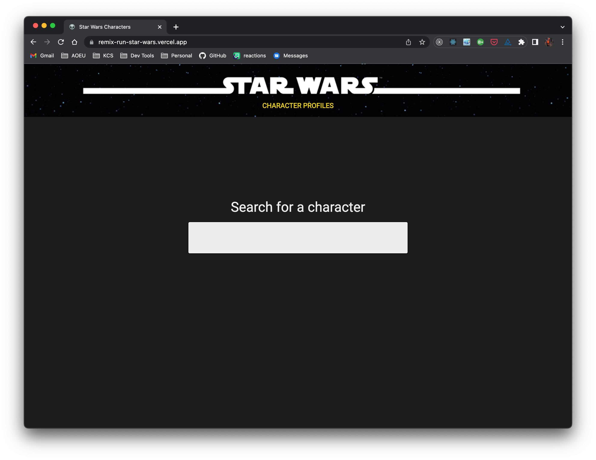
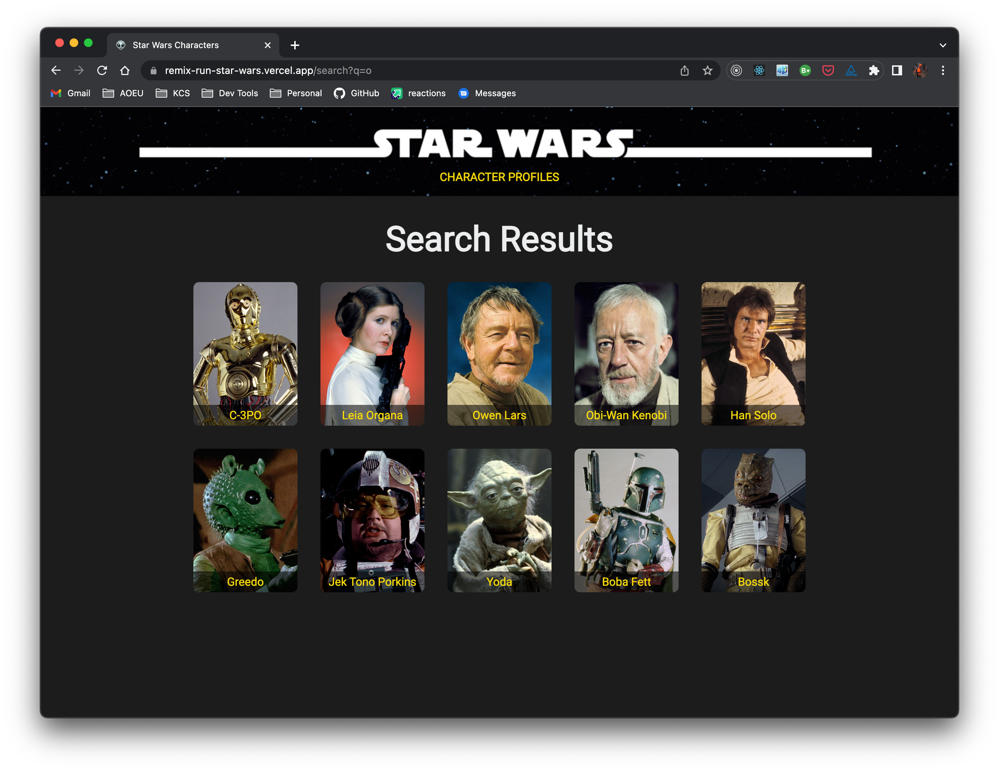
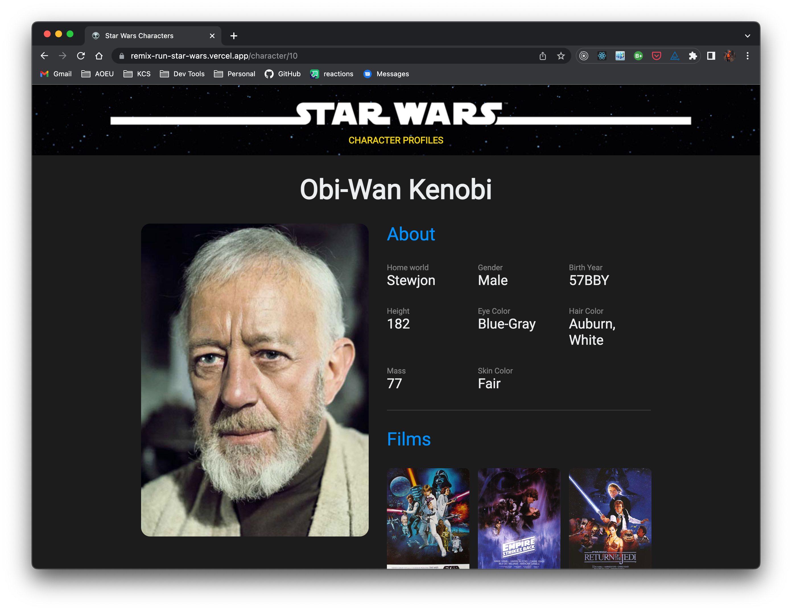

# Star Wars app with Remix.run

This is a fun little application that makes use of the [Star Wars API](https://swapi.dev) and allows you to search for Star Wars characters, view search results, and view character profiles. It is built with [Remix](https://remix.run) as the framework, and uses [Stitches](https://stitches.dev/) for CSS/styling. The code from here is built and deployed on [Vercel](https://vercel.com/), and the resulting application can be viewed and experienced at [https://remix-run-star-wars.vercel.app/](https://remix-run-star-wars.vercel.app/).

## Why I chose Remix

I chose to write this application with Remix because of the feature-set that it provides out-of-the-box, while maintaining a simple organizational structure for the code that is easy to understand and maintain. Making use of the appropriate constructs that Remix provides, and with JavaScript enabled in the browser, the application runs entirely in the browser as a Single Page Application (SPA). However, by changing absolutely nothing in the code at all, users are able to [disable JavaScript](https://remix.run/docs/en/v1/guides/disabling-javascript) in the browser altogether, and the application will continue to work _exactly the same_, by calling out to the server and making full round-trips to generate and load page content from the server.

This capability of Remix allows for a seamless implementation of progressive enhancement in applications that can't be achieved using other libraries/frameworks without writing excessive amounts of additional code to support the same functionality. [Next.js](https://nextjs.org/) can come close to achieving similar capabilities, but not with JavaScript disabled in the browser altogether. In my humble opinion, this unique and significant distinction sets Remix apart as a better solution.

## Running locally

Clone [the repository](https://github.com/ryexley/remix-run-star-wars) to a local folder, and then in that folder run `npm install`. Once npm has installed all of the dependencies, run `npm run dev` and the application will run and will be viewable in your browser at [http://localhost:7700](http://localhost:7700).

## Known areas for significant improvement

This is an application that I put together over the course of a few hours here and there in a week. It works, but given some more time put into it, there are several areas where it could be fairly significantly improved ...

* **[Responsive Design](https://developer.mozilla.org/en-US/docs/Learn/CSS/CSS_layout/Responsive_Design)** - More time committed UI styling (CSS) to implemented a responsive design would make for a significantly better experience of the application on mobile devices. The current implementation does not render will at all on mobile devices.
* **Error handling** - There is little-to-no error handling in the code at the moment. Specifically, I would add error handling around the http requests to the SWAPI endpoints where data is being fetched, as well as [React Error Boundaries](https://reactjs.org/docs/error-boundaries.html) to more gracefully handle any errors that occur at runtime.
* **Transitions and Pending UI** - For the most part, in my manual testing and on my laptop and internet connection, the SWAPI endpoints have been very responsive, which has made the application itself mostly very responsive and fast. However, that will not always be the case for everyone, and for those using devices with lesser hardware resources, or slower internet connections, a significant improvement that could be made would be to take advantage of Remix's support for [data mutation and loading transitions](https://remix.run/docs/en/v1/api/remix#usetransition), which can often provide a much better user experience in situations where you are waiting for data to load or other time-intensive operations to complete. Given more time, I would like to take advantage of that to improve the user experience.
* **Type definitions** - At a bare minimum, I would take the time to define [PropTypes](https://reactjs.org/docs/typechecking-with-proptypes.html) for component props. Taking it to the next level, [TypeScript](https://www.typescriptlang.org/) could be enabled, and types could be defined for all input and output types, which could help potentially eliminate an entire class of possible defects in the app.
* **Unit Testing** - I would love to use either [Jest](https://jestjs.io/) or [Vitest](https://vitest.dev/) (this one would be my preference today) to write some unit tests for individual components and modules (specifically, the service client modules).
* **End-to-end / Integration Testing** - I would ideally also love to use [Cypress](https://www.cypress.io/) to write some end-to-end integration tests to automate the process of ensuring the full character search and profile view functionality works as designed.

## Disclaimer and Credits

I would like for it to be noted that I am NOT a good designer at all. Any design credit for any work that I do for the web should nearly always go to either a designer that knows what they're doing, whose design I implement, or some source for inspiration that I find on the internet. In this case, I found [another Star Wars application](https://react-star-wars-api.vercel.app/) implementation [on GitHub](https://github.com/LeonelUbeda/react-star-wars) (there are several of them out there) that I took design inspiration from. I also made use of the [GitHubRaw](https://githubraw.com/) server to consume some of the images that [Leonel Ubeda](https://github.com/LeonelUbeda) has available in that public repository to make this application look a little nicer.

I would also like to point out and emphasize that while the output and final result of my application may share some design inspiration and image elements from the application noted, it should hopefully be clear that no _code_ was taken from his implementation at all, and mine was completely and 100% written by me.
